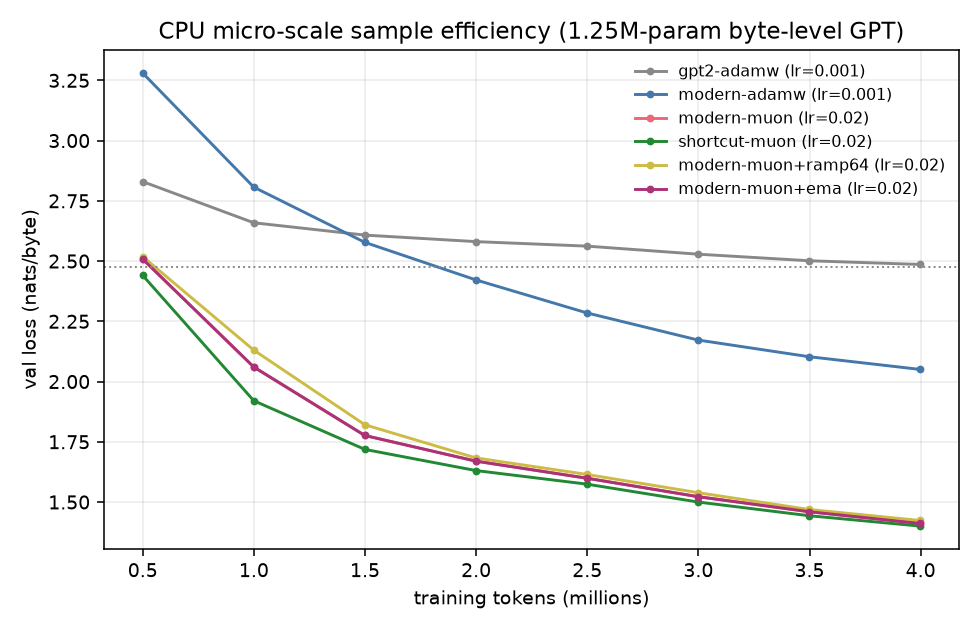

# CPU micro-scale sample-efficiency results

**Question:** do the modded-nanogpt recipe's ingredients actually buy sample
efficiency, when tested independently under controlled conditions — and do two
additions absent from the recipe (an early-position loss ramp; EMA weight
averaging) buy any more?

**Setup** (see `train_micro.py`, `make_data.py`): byte-level GPT, 6 layers,
dim 128, 4 heads, seq 512, ~1.25M params; 22.4MB of real English text (NLTK
gutenberg + webtext + reuters) cut into non-overlapping 513-byte windows,
shuffled with a fixed seed; 5% held out for validation. Every run consumes the
**identical window stream** with a fixed budget of **4,000,000 training
tokens** (488 steps × 16×512), and is scored on the same held-out windows
(curve evals on 131,072 tokens; finals on 524,288). Learning rate swept per
variant; all optima were interior to the sweeps except where noted. Training
is fully deterministic: a re-run of the same configuration reproduces the
final loss bit-for-bit.

Hardware: 4 CPU cores. This is ~100,000× smaller compute than the real
benchmark, which is exactly why it's runnable here — and why the numbers below
measure *directions and orderings*, not what happens at 124M parameters.

## Final validation loss at the 4M-token budget (best lr per variant)

| variant | what it tests | best lr | final val loss | tokens to reach baseline's final loss |
|---|---|---|---|---|
| `gpt2-adamw` | GPT-2-style arch + AdamW (tuned baseline) | 1e-3 | 2.4739 | 4.0M (by definition) |
| `modern-adamw` | + rotary, RMSNorm, QK-norm, ReLU², zero-init, untied head, softcap | 1e-3 | 2.0369 | 2.0M (**2× fewer**) |
| `modern-muon` | + Muon on hidden matrices | 0.02 | 1.4059 | 1.0M (**4× fewer**) |
| `shortcut-muon` | + value embeddings, x0 shortcut, U-net skips | 0.02 | **1.3920** | ≤0.5M (**≥8× fewer**, crosses by the first eval point) |
| `modern-muon+ramp64` | **original idea:** ramp CE weight over first 64 positions | 0.02 | 1.4173 | 1.0M |
| `modern-muon+ema` | **recipe-gap test:** Polyak/EMA weights at eval (decay 0.99) | 0.02 | 1.4059 raw / 1.4275 EMA | 1.0M |

## Findings

1. **The recipe replicates.** Each imported tier is a large, unambiguous
   sample-efficiency win at this scale: architecture alone reaches the tuned
   baseline's final loss with 2× fewer tokens; adding Muon makes it ~4×
   (crossing between 0.5M and 1M tokens); the shortcut bundle is both the
   best final (1.3920 @ lr 0.02 vs 1.4166 @ 0.05) and
   the fastest early, crossing the baseline's final loss by the first eval
   point (≤0.5M tokens, i.e. ≥8× fewer). The
   effect sizes here are larger than at 124M scale (where Muon's measured
   gain is ~1.3–1.5×) — small models on short horizons exaggerate optimizer
   differences — so treat orderings, not magnitudes, as the transferable
   result.
2. **Early-position loss ramp: negative.** 1.4173 vs 1.4059 at equal budget.
   The hypothesis was that context-poor window starts inject gradient noise;
   evidently their signal still outweighs the noise at this scale. (Related
   context: the speedrun's BOS-alignment record suggests *document-aligned*
   starts matter; reweighting the loss apparently does not capture that.)
3. **EMA at eval: negative.** 1.4275 (EMA) vs 1.4059 (raw). The recipe's
   stable-then-decay schedule (linear cooldown to 0.1×) already performs the
   averaging that EMA would provide, and a lagging average is strictly worse
   by the end of the cooldown. This is consistent with the speedrun community
   never having adopted EMA despite 84 records of aggressive tuning.
4. **Methodological note.** v1 of this experiment read a ~130-document corpus
   sequentially, which made the training stream non-stationary and the val
   slice unrepresentative; every variant's val loss *rose* late in training
   (archived in `results_v1_confounded.jsonl`). If you build small LM
   experiments: shuffle at the sequence level, or your metric measures style
   drift rather than learning.

## Caveats

* Byte-level vocab (256) instead of GPT-2 BPE (50257): FineWeb GPT-2 shards
  were unreachable from this environment (HuggingFace blocked by egress
  policy). The head/embedding dynamics under a 50k vocab — where Adam-on-head
  vs Muon-on-hidden splits matter more — are not exercised here.
* One seed per configuration (deterministic); no error bars. The tier gaps
  (0.4–0.6 nats) dwarf plausible seed noise at this scale; the small
  differences between the Muon-tier variants (~0.01 nats) do not, and should
  be read as "no detectable effect".
* 4M-token horizon; conclusions about long-horizon behavior (e.g., whether
  the AdamW tiers would eventually catch up) are out of scope.
* The Muon-tier lr sweeps were coarse ({0.02, 0.05}) and the optimum sat at
  the lower edge; the AdamW sweeps ({5e-4, 1e-3, 3e-3}) had interior optima.
  A finer Muon sweep could shift the small within-tier differences, not the
  tier ordering.
